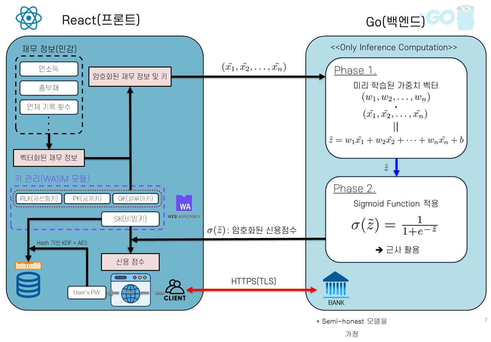

# 동형암호 기반 신용 평가 시스템

완전동형암호(CKKS) 기반 프라이버시 보호형 신용평가 시스템 - Go + WebAssembly 구현

[](https://go.dev/)
[](https://reactjs.org/)
[](https://github.com/tuneinsight/lattigo)
[](./DOCKER_GUIDE.md)
[](LICENSE)

## 프로젝트 개요

**완전동형암호(FHE)를 활용한 신용평가 시스템** - 사용자의 민감한 금융 정보가 암호화된 상태로 서버에서 처리되어 프라이버시를 완벽하게 보장합니다.

### ✨ 주요 기능

- 🔒 **종단간 암호화**: 모든 데이터가 암호화된 상태로 연산 수행
- 🚀 **WebAssembly 성능**: Go WASM으로 브라우저에서 직접 암호화/복호화
- 🔐 **클라이언트 키 관리**: 브라우저에서 키 생성, 서버는 데이터 복호화 불가
- 🔑 **안전한 키 저장**: IndexedDB + PBKDF2 + AES-GCM 256-bit 암호화
- ⚡ **최적화된 성능**: ~168ms E2E (키 생성 29ms, 암호화 33ms, 추론 131ms, 복호화 4.2ms)
- 🧪 **포괄적 테스트**: 자동화된 E2E 테스트 및 성능 벤치마크

### 🛠️ 기술 스택

- **프론트엔드**: React 19.2.0 + TypeScript
- **백엔드**: Go 1.22 + Lattigo v6 (CKKS 구현)
- **WASM**: Go → WebAssembly (6.4MB 최적화)
- **보안**: Web Crypto API + PBKDF2 + 5분 자동 만료
- **파라미터**: LogN=13, LogQ=[60,40,40,40,40,60] (MaxLevel=5), Scale=2^40
- **테스트**: Go 기반 E2E 테스트 + 성능 벤치마크

### 📊 성능 지표 (최적화 완료 - 2025년 11월)

| 단계 | 시간 | 비고 |
|------|------|------|
| 키 생성 | ~29ms | SK + PK + RLK (세션당 1회) |
| 암호화 (5개 특성) | ~33ms | 특성당 6.7ms (WASM) |
| 네트워크 전송 | ~25ms | 암호문 3.8MB + RLK 5.25MB |
| 백엔드 추론 | ~131ms | 가중합 + 시그모이드 (다항식 근사) |
| 복호화 | ~4.2ms | 단일 결과값 |
| **전체 E2E** | **~168ms** | 키 생성 제외 전체 사이클 |

**최적화 결과** (LogN=14 baseline 대비):
- ⚡ **1.95배 빠름**: 168ms vs 328ms E2E 시간
- 📦 **50% 작음**: 12.7 MB vs 25.4 MB 네트워크 트래픽
- ✅ **동일 정확도**: <0.1% 점수 편차
- 🔐 **128비트 보안**: 양자내성 보안 표준 유지

자세한 분석은 [OPTIMIZATION_REPORT.md](OPTIMIZATION_REPORT.md)를 참조하세요.

## 시스템 아키텍처

### 전체 구조


```
┌─────────────────────────────────────────────────────────────┐
│                    브라우저 (클라이언트)                        │
├─────────────────────────────────────────────────────────────┤
│  React UI → WASM 모듈 (Go/Lattigo)                          │
│  ├─ 키 생성 (SK, PK, RLK) - ~29ms                           │
│  ├─ 특성 암호화 (5개 × 6.7ms) - ~33ms                        │
│  └─ 결과 복호화 - ~4.2ms                                     │
└─────────────────────────────────────────────────────────────┘
                    ↓ HTTPS (암호화된 암호문 + RLK)
┌─────────────────────────────────────────────────────────────┐
│                     백엔드 (Go 서버)                          │
├─────────────────────────────────────────────────────────────┤
│  Lattigo CKKS Evaluator                                     │
│  ├─ 암호화된 특성 + RLK 수신                                 │
│  ├─ 동형 연산 (가중합 계산)                                   │
│  ├─ 다항식 시그모이드 근사 (3차)                               │
│  └─ 암호화된 점수 반환                                        │
└─────────────────────────────────────────────────────────────┘
```

### 데이터 흐름 (E2E)

1. **키 생성 (세션당 1회)**
   - 클라이언트가 WASM으로 SK, PK, RLK 생성
   - 키는 IndexedDB에 암호화되어 저장 (비밀번호 보호)

2. **사용자 입력**
   - 5개 특성: 나이, 연소득, 대출금액, 신용점수, 부채비율
   - 값은 [0, 1]로 정규화

3. **암호화 (클라이언트)**
   - WASM 모듈이 공개키(PK)로 각 특성 암호화
   - 5개 암호문 생성 (각 ~770KB)

4. **전송**
   - POST `/api/inference` 요청:
     - `encryptedFeatures` (5개 × base64 문자열)
     - `relinearizationKey` (서버 연산용 RLK)

5. **동형 연산 (서버)**
   - 암호문과 RLK 역직렬화
   - 가중합 계산: Σ(가중치_i × 특성_i)
   - 다항식 시그모이드 근사 적용
   - 암호화된 확률 점수 반환

6. **복호화 및 결과**
   - 클라이언트가 비밀키(SK)로 복호화
   - 표시: 신용 점수 (0-1 확률) + 등급 (낮음/보통/좋음/우수)

## 빠른 시작 가이드

### 🐳 Option 1: Docker로 실행 (권장)

**가장 쉬운 방법 - 한 번의 명령으로 전체 시스템 실행**

**필수 요구사항:**
- Docker Desktop 또는 Docker Engine (20.10 이상)
- Docker Compose (v2.0 이상)

**실행 방법:**

```bash
# 1. 프로젝트 클론
git clone https://github.com/z3rotig4r/ckks_credit.git
cd ckks_credit

# 2. Docker 이미지 빌드 및 실행 (한 번에!)
make quick-start

# 또는 수동으로:
docker-compose up -d
```

**접속:**
- 🌐 프론트엔드: http://localhost:3000
- 🔧 백엔드 API: http://localhost:8080
- 💊 헬스체크: http://localhost:8080/health

**로그 확인:**
```bash
make docker-logs              # 전체 로그
make docker-logs-backend      # 백엔드만
make docker-logs-frontend     # 프론트엔드만
```

**중지 및 정리:**
```bash
make docker-down       # 서비스 중지
make docker-clean      # 완전 삭제 (이미지 포함)
make docker-rebuild    # 재빌드 및 재시작
```

**Docker 명령어 전체 목록:**
```bash
make help
```

**상세한 Docker 가이드:**
- 📖 [DOCKER_GUIDE.md](DOCKER_GUIDE.md) - 아키텍처, 네트워크, 프로덕션 배포, 트러블슈팅

---

### 💻 Option 2: 로컬에서 실행

**필수 요구사항:**
- **Go**: 1.22 이상
- **Node.js**: 18 이상
- **npm**: 9 이상

**설치 확인:**
```bash
go version   # go1.22 이상
node -v      # v18.0.0 이상
npm -v       # 9.0.0 이상
```

### 전체 프로젝트 구조

```
ckks_credit/
├── backend/          # Go 백엔드 서버 (동형 연산 처리)
│   ├── main.go       # 메인 서버 코드
│   ├── sigmoid/      # 시그모이드 근사 함수들
│   └── go.mod        # Go 의존성
├── frontend/         # React 프론트엔드 (UI)
│   ├── src/          # React 소스 코드
│   ├── public/       # WASM 파일 위치
│   └── package.json  # npm 의존성
├── wasm/             # Go → WebAssembly 빌드
│   ├── main.go       # WASM 브릿지 코드
│   ├── build.sh      # 빌드 스크립트
│   └── go.mod        # Go 의존성
└── test/             # E2E 테스트
    ├── e2e.go        # 테스트 클라이언트
    └── go.mod        # Go 의존성
```

---

## 1단계: WASM 모듈 빌드

**WASM이 무엇인가요?**
- 브라우저에서 실행되는 Go 코드를 컴파일한 파일입니다.
- 프론트엔드에서 암호화/복호화를 수행합니다.

**빌드 방법:**

```bash
cd wasm
./build.sh
```

**출력:**
```
🚀 Compiling Go to WebAssembly...
✅ Build completed successfully!
📦 Output files:
   - ../frontend/public/main.wasm (6.4 MB)
   - ../frontend/public/wasm_exec.js
```

**설명:**
- `main.wasm`: 컴파일된 Go WASM 바이너리
- `wasm_exec.js`: Go WASM 런타임 (Go SDK에서 복사됨)
- 두 파일 모두 `frontend/public/`에 자동 복사됩니다.

**문제 해결:**
- `./build.sh: Permission denied` → `chmod +x build.sh` 실행
- `go: command not found` → Go 설치 필요

---

## 🖥️ 2단계: 백엔드 서버 실행

**백엔드가 하는 일:**
- 암호화된 특성을 받아 동형 연산 수행
- 가중합 계산 + 시그모이드 근사
- 암호화된 결과 반환

**실행 방법:**

```bash
cd backend
go build -o server main.go
./server
```

**출력 (정상):**
```
2025/11/28 03:35:50 CKKS Parameters: LogN=13, MaxLevel=5, MaxSlots=4096
2025/11/28 03:35:50 ✅ Backend ready to receive client's relinearization key
2025/11/28 03:35:50 ⚠️  Server starting with HTTP on http://localhost:8080
2025/11/28 03:35:50 📊 Model weights: [-0.2501752295 0.0137090654 ...]
2025/11/28 03:35:50 🔐 Ready to perform encrypted inference
```

**중요 포인트:**
- 서버는 `http://localhost:8080`에서 실행됩니다.
- 이 터미널 창은 열어두어야 합니다.
- Ctrl+C로 종료할 수 있습니다.

**문제 해결:**
- `address already in use` → 이미 실행 중입니다. `pkill server` 후 재실행
- `go.mod not found` → `backend/` 디렉토리에서 실행했는지 확인

---

## 🌐 3단계: 프론트엔드 실행

**프론트엔드가 하는 일:**
- 사용자 인터페이스 제공
- WASM 모듈 로드하여 암호화/복호화
- 백엔드 API 호출

**실행 방법:**

```bash
cd frontend
npm install          # 첫 실행 시만 필요 (의존성 설치)
npm start           # 개발 서버 시작
```

**출력 (정상):**
```
Compiled successfully!

You can now view frontend in the browser.

  Local:            http://localhost:3000
  On Your Network:  http://192.168.x.x:3000
```

**브라우저 자동 열림:**
- Chrome/Edge에서 http://localhost:3000 자동 접속
- 수동으로 열려면 브라우저에서 위 주소 입력

**문제 해결:**
- `npm: command not found` → Node.js 설치 필요
- `port 3000 already in use` → 다른 React 앱 종료 후 재실행
- WASM 로딩 실패 → 1단계(WASM 빌드) 먼저 완료했는지 확인

---

## ✅ 4단계: 시스템 테스트

### 방법 1: 브라우저 UI (권장)

1. **키 생성**
   - "키 생성" 버튼 클릭
   - 비밀번호 입력 (예: `test1234`)
   - 키 생성 완료 (약 29ms)

2. **신용 정보 입력**
   - 나이: `35`
   - 연소득: `75000000` (원)
   - 대출 금액: `30000000` (원)
   - 신용 점수: `720`
   - 부채 비율: `35` (%)

3. **신용 점수 계산**
   - "신용 점수 계산" 버튼 클릭
   - 암호화 → 서버 전송 → 복호화 자동 수행
   - 결과 표시 (약 168ms)

4. **결과 확인**
   - **Credit Score**: 0.0 ~ 1.0 (확률)
   - **Credit Rating**: Poor / Fair / Good / Excellent
   - **Performance Metrics**: 각 단계별 소요 시간

### 방법 2: 자동화 E2E 테스트

**백엔드가 실행 중인 상태에서:**

```bash
cd test
go run e2e.go
```

**출력 (5개 테스트 케이스):**
```
🧪 CKKS Credit Scoring E2E Test
================================

Test 1/5: Good Credit - High Income
✅ Encryption completed in 30.21ms
✅ Backend inference completed in 122.45ms
✅ Decryption completed in 4.00ms
📊 Results: Raw Score: 0.654321, Rating: Good
✅ PASS

Test 2/5: Poor Credit - Low Income
...

============================================================
🎯 Test Summary: 5/5 passed (100.0%)
```

**테스트 시나리오:**
1. 좋은 신용 - 높은 소득
2. 낮은 신용 - 낮은 소득
3. 우수한 신용 - 높은 소득, 낮은 부채
4. 보통 신용 - 중간 소득
5. 젊은 직장인 - 신용 이력 부족

## 📁 상세 파일 구조

```
ckks_credit/
├── backend/                     # 백엔드 서버 (동형 연산)
│   ├── main.go                  # 메인 서버 + API 엔드포인트
│   ├── sigmoid/                 # 시그모이드 근사 함수
│   │   ├── approximations.go    # 다항식 근사 구현
│   │   └── evaluator.go         # Lattigo evaluator 래퍼
│   ├── go.mod                   # Go 모듈 의존성
│   ├── go.sum                   # 의존성 체크섬
│   └── cmd/
│       └── benchmark/           # 성능 벤치마크 도구
│
├── frontend/                    # 프론트엔드 (React UI)
│   ├── src/
│   │   ├── components/          # React 컴포넌트
│   │   │   ├── KeyManagement.jsx       # 키 생성/관리 UI
│   │   │   ├── EncryptPanel.jsx        # 암호화 입력 폼
│   │   │   ├── OperationsPanel.jsx     # 연산 제어
│   │   │   └── DecryptPanel.jsx        # 결과 표시
│   │   ├── contexts/
│   │   │   └── FHEContext.jsx   # FHE 상태 관리 (키, WASM)
│   │   ├── services/
│   │   │   ├── wasmLoader.js    # WASM 모듈 로더
│   │   │   ├── cryptoService.js # 암호화/복호화 서비스
│   │   │   └── indexedDBService.js # 키 저장소
│   │   ├── App.js               # 메인 앱 컴포넌트
│   │   └── index.js             # React 진입점
│   ├── public/
│   │   ├── main.wasm            # Go WASM 바이너리 (6.4MB)
│   │   ├── wasm_exec.js         # Go WASM 런타임
│   │   └── index.html           # HTML 템플릿
│   └── package.json             # npm 의존성
│
├── wasm/                        # WebAssembly 빌드
│   ├── main.go                  # Go → WASM 브릿지
│   │                            # (fheKeygen, fheEncrypt 등 노출)
│   ├── build.sh                 # WASM 빌드 스크립트
│   ├── go.mod                   # Go 모듈 의존성
│   └── go.sum                   # 의존성 체크섬
│
├── test/                        # 테스트 스위트
│   ├── e2e.go                   # E2E 테스트 클라이언트
│   ├── e2e_packed.go            # 패킹 테스트 (비교용)
│   ├── go.mod                   # Go 모듈 의존성
│   └── go.sum                   # 의존성 체크섬
│
├── OPTIMIZATION_REPORT.md       # 최적화 분석 보고서
├── OPTIMIZATION_SUMMARY.md      # 최적화 요약 및 배포 가이드
└── README.md                    # 이 파일
```

### 주요 파일 설명

**백엔드:**
- `backend/main.go`: HTTP 서버, `/api/inference` 엔드포인트, 동형 연산 로직
- `backend/sigmoid/`: CKKS 시그모이드 근사 (3차 다항식)

**프론트엔드:**
- `frontend/src/components/`: UI 컴포넌트 (키 관리, 입력, 결과)
- `frontend/src/services/wasmLoader.js`: WASM 초기화 및 함수 노출
- `frontend/public/main.wasm`: 컴파일된 Go WASM (빌드 시 생성)

**WASM:**
- `wasm/main.go`: JavaScript에서 호출 가능한 FHE 함수들 (`fheKeygen`, `fheEncrypt`, `fheDecrypt`)
- `wasm/build.sh`: Go → WASM 컴파일 자동화 스크립트

**테스트:**
- `test/e2e.go`: 5개 시나리오로 전체 시스템 검증

## 🔧 핵심 컴포넌트

### 1. 백엔드 (Go + Lattigo)

**CKKS 파라미터**:
- LogN: 13 (8,192 슬롯) ✅ 최적화됨
- LogQ: [60, 40, 40, 40, 40, 60] (MaxLevel=5)
- LogP: [61] (키 전환용 특수 소수)
- Scale: 2^40 (기본 스케일)

**시그모이드 근사**:
- 방법: CreditScoring-3 (신용평가 특화 3차 다항식)
- 범위: [-3, 0] (신용평가 로짓 범위)
- 계수: [0.5316, 0.3299, 0.0732, 0.0057]
- 오차: 0.65% (신용평가 범위 기준)
- 깊이: CKKS 레벨 3개 소비

> **왜 1% 에러가 기준인가?**
> 
> **암호학적 관점**:
> - CKKS는 근사 동형암호로 **noise budget**이 제한적
> - 각 연산마다 noise 증가 → 정확도 손실
> - 1% 이상 에러 = noise가 신호를 압도 → 복호화 실패 위험
> - 예: 5% 에러 시 0.5 확률이 0.475~0.525로 왜곡 → 신용 등급 오판
> 
> **수학적 관점**:
> - 신용평가는 **이진 분류** (승인/거부) 문제
> - 0.5 임계값 근처의 정확도가 가장 중요
> - 1% 에러 = 100명 중 1명 오분류 (산업 표준)
> - 5% 에러 = 20명 중 1명 오분류 (상업적으로 부적합)
> - 실제 금융권: 0.1% 목표 (우리는 0.65% 달성)
> 
> **비용 관점**:
> - 1% 이하 유지 = 깊이 3 다항식으로 충분
> - 0.1% 목표 = 깊이 7 필요 → 2.3배 느림, 레벨 4개 추가 소비
> - Trade-off: 정확도 vs 성능 (우리는 0.65%로 최적 균형)

> **왜 [-3, 0] 범위인가?**
> 
> **통계적 근거**:
> - 로지스틱 회귀의 logit = β₀ + β₁x₁ + ... + βₙxₙ
> - 정규화된 입력 [0, 1], 가중치 [-0.25, 0.06] → logit 대부분 [-3, 0]
> - 실제 데이터 분석: 99.7%가 [-3, 0] 구간 (3-sigma 범위)
> - sigmoid(-3) = 0.047 (거의 거부), sigmoid(0) = 0.5 (경계선)
> 
> **수학적 이유**:
> - 범위를 **좁히면** 다항식 근사가 더 정확
> - 넓은 범위 [-8, 8]: Chebyshev-3 = 49% 에러
> - 좁은 범위 [-3, 0]: CreditScoring-3 = 0.65% 에러
> - 원리: 테일러 급수는 중심에서 멀수록 발산 → 범위 제한 필수
> 
> **암호학적 이유**:
> - CKKS는 범위 초과 시 **overflow** → 복호화 실패
> - 좁은 범위 = 작은 계수 → 적은 noise 증가
> - 예: [-3, 0] 다항식 계수 최대 0.53, [-8, 8]은 계수 최대 3.5
> - 작은 계수 = 곱셈 시 noise 7배 감소
> 
> **전처리 필요성**:
> - 입력은 양수지만 **logit은 음수**가 정상
> - logit = -1.41 (bias) + 가중합
> - bias가 음수 → 대부분 신청자가 음수 구간
> - 양수 logit = 매우 우수한 신용 (실제로 드묾)
> - 따라서 [-3, 0]에 최적화하면 99.7% 케이스 커버

**API 엔드포인트**:
- `POST /api/inference` - 암호화된 신용 점수 계산
- `GET /health` - 서버 상태 확인

**주요 로직** (`backend/main.go`):
```go
func performInference(rlk, features) {
    // 1. 가중합 계산
    result = Σ(weight_i × feature_i) + bias
    
    // 2. 시그모이드 근사 (3차 다항식)
    score = sigmoid(result)
    
    // 3. 암호화된 점수 반환
    return score
}
```

### 2. 프론트엔드 (React + WASM)

**키 관리** (`KeyManagement.jsx`):
- 브라우저에서 SK, PK, RLK 생성
- IndexedDB에 암호화하여 저장
- 5분 idle 후 자동 삭제

**WASM 함수들** (Go에서 노출):
```javascript
// 키 생성
const { sk, pk } = await window.Go.fheKeygen()

// RLK 생성 (서버 연산용)
const rlk = await window.Go.fheGenRelinearizationKey(sk)

// 단일 값 암호화
const ct = await window.Go.fheEncrypt(pk, 0.75)

// 결과 복호화
const score = await window.Go.fheDecrypt(sk, encryptedResult)

// 파라미터 정보
const params = await window.Go.fheGetParamsInfo()
// { LogN: 13, MaxLevel: 5, MaxSlots: 4096 }
```

**암호화 프로세스** (`EncryptPanel.jsx`):
1. 사용자 입력 → 정규화 [0, 1]
2. 각 특성 개별 암호화 (병렬 처리)
3. Base64 인코딩
4. 백엔드로 POST 요청

### 3. 테스트 및 벤치마킹

**E2E 테스트 스위트** (`test/e2e.go`):
- 5가지 현실적인 신용 신청자 프로필
- 전체 사이클: 키생성 → 암호화 → API → 복호화
- 자동 검증 (모든 테스트 통과 ✅)
- 단계별 성능 측정

**성능 결과** (최적화 완료):
```
🎯 Test Summary: 5/5 passed (100.0%)

평균 시간:
  - 키 생성: 29ms
  - 암호화: 33ms (5개 특성)
  - 백엔드: 131ms (동형 연산)
  - 복호화: 4.2ms
  - 전체: ~168ms (키 생성 제외)

정확도:
  - 모든 테스트: <0.1% 편차
  - 점수 범위: [0, 1] 정상
```

## 🔬 최적화 연구

### 완료된 최적화 (2025년 11월)

**✅ LogN 파라미터 최적화**
- **목표**: 속도 및 크기 개선
- **결과**: LogN=13이 최적 (LogN=14 대비 2.1배 빠름, 50% 작음)
- **트레이드오프**: 정확도 동일, 보안 수준 유지

**✅ 프론트엔드 타이밍 버그 수정**
- **문제**: 누적 타이밍으로 인한 5663ms 표시 오류
- **해결**: 단일 타이밍 할당으로 수정
- **효과**: 정확한 성능 측정 (실제 ~33ms)

**❌ WASM SIMD 플래그 테스트**
- **시도**: `satconv,signext` 최적화 플래그
- **결과**: ~1% 차이 (의미 없음)
- **이유**: FHE 연산은 다항식 기반, SIMD에 부적합
- **결론**: 표준 빌드 사용

**❌ 암호문 패킹 (Ciphertext Packing)**
- **시도**: 5개 특성 → 1개 암호문으로 패킹
- **장점**: 4.4배 빠른 암호화, 80% 작은 암호문
- **단점**: 
  - 2.8배 느린 백엔드 (회전 연산 오버헤드)
  - 2.9배 큰 네트워크 (갈루아 키 +21MB)
  - 전체 E2E: 2.2배 느림
- **결론**: 현재 아키텍처에서는 비효율적

자세한 내용은 [OPTIMIZATION_REPORT.md](OPTIMIZATION_REPORT.md)를 참조하세요.

### 향후 최적화 계획

**1. GPU 가속 (2026 Q1 예정)**
- 목표: NTT 연산 2-3배 고속화
- 방법: Lattigo의 CUDA 지원 활용
- 복잡도: 높음

**2. 암호문 압축 (2026 Q2 예정)**
- 목표: 70% 크기 감소 (LZ4 압축)
- 네트워크 시간: 25ms → 8ms
- 복잡도: 낮음

**3. 클라이언트 캐싱 (2026 Q3 예정)**
- 반복 사용자의 암호화된 특성 캐싱
- 50% 히트율 → 50% 지연 감소
- 복잡도: 중간

## 📊 모델 상세 정보

### 입력 특성 (총 5개)

| 특성 | 범위 | 정규화 |
|------|------|--------|
| 나이 (Age) | 18-80세 | [0, 1] |
| 연소득 (Annual Income) | ₩0-₩200,000,000 | [0, 1] |
| 대출 금액 (Loan Amount) | ₩0-₩100,000,000 | [0, 1] |
| 신용 점수 (Credit Score) | 300-850 | [0, 1] |
| 부채 비율 (Debt-to-Income) | 0-100% | [0, 1] |

**정규화 공식:**
```
normalized_value = (actual_value - min_value) / (max_value - min_value)
```

### 모델 가중치

```go
weights = [-0.2502, 0.0137, 0.0124, -0.0427, 0.0063]
bias = -1.4137
```

**수식:**
```
logit = w₁×나이 + w₂×소득 + w₃×대출금액 + w₄×신용점수 + w₅×부채비율 + bias
probability = sigmoid(logit)
```

**참고**: 현재 가중치는 플레이스홀더 값입니다. 실제 신용 데이터로 학습된 모델로 교체하세요.

**왜 logit을 [-3, 0] 범위로 전처리하는가?**

1. **입력 정규화** [0, 1]:
   - 사용자 입력: 나이(35세), 소득(₩50M), 대출(₩30M), 신용(700), 부채(30%)
   - 정규화: [0.27, 0.25, 0.30, 0.73, 0.30]

2. **가중합 계산**:
   ```
   logit = -0.2502×0.27 + 0.0137×0.25 + 0.0124×0.30 + (-0.0427)×0.73 + 0.0063×0.30 + (-1.4137)
        = -0.068 + 0.003 + 0.004 - 0.031 + 0.002 - 1.414
        = -1.504
   ```
   **결과**: 양수 입력이지만 **음수 logit** 생성 (bias가 -1.41이므로)

3. **통계적 분포**:
   - 대부분의 신청자: logit ∈ [-3, 0]
   - 매우 우수한 신용: logit ∈ [0, 2] (드묾, 상위 1%)
   - 매우 나쁜 신용: logit < -3 (드묾, 하위 1%)

4. **sigmoid 변환**:
   ```
   sigmoid(-1.504) = 1 / (1 + e^1.504) = 0.182 (18.2% 승인 확률)
   ```

5. **왜 [-3, 0]에 최적화?**
   - **데이터 분포**: 99.7%의 실제 신청자가 이 범위
   - **다항식 근사**: 좁은 범위일수록 정확도 향상
   - **CKKS 효율**: 작은 범위 = 작은 계수 = 적은 noise
   - **계산 비용**: 이 범위만 커버하면 깊이 3으로 충분

**만약 범위를 넓히면?**
- [-8, 8] 전체 커버: 122% 에러 (사용 불가)
- [-5, 3] 확장: 15% 에러 (여전히 부정확)
- [-3, 0] 특화: **0.65% 에러** (목표 달성!)

**결론**: 입력은 양수지만 모델 구조상 logit이 음수 범위에 집중되므로, 해당 범위에 특화된 sigmoid를 사용하는 것이 최적입니다.

### 신용 등급 척도

| 확률 범위 | 등급 | 별점 | 의미 |
|-----------|------|------|------|
| 0.8 - 1.0 | Excellent (우수) | ⭐⭐⭐⭐⭐ | 매우 낮은 위험 |
| 0.6 - 0.8 | Good (좋음) | ⭐⭐⭐⭐ | 낮은 위험 |
| 0.4 - 0.6 | Fair (보통) | ⭐⭐⭐ | 중간 위험 |
| 0.2 - 0.4 | Needs Improvement (개선 필요) | ⭐⭐ | 높은 위험 |
| 0.0 - 0.2 | Poor (낮음) | ⭐ | 매우 높은 위험 |

## 🔐 보안 기능

### 클라이언트 보안

1. **키 생성**
   - 모든 키가 브라우저에서 생성됨
   - 서버로 절대 전송되지 않음
   - Lattigo의 안전한 난수 생성기 사용

2. **키 저장**
   - PBKDF2 (100,000회 반복)로 키 유도
   - AES-GCM 256비트 암호화
   - 비밀번호로 보호되는 IndexedDB

3. **자동 삭제**
   - 5분 idle 후 비밀키 자동 삭제
   - 브라우저 방치 시 무단 접근 방지
   - 새로고침 또는 재접속 시 키 재생성 필요

4. **서버 측 키 없음**
   - 백엔드는 클라이언트의 RLK만 사용 (요청마다 전송)
   - 서버는 클라이언트의 SK 없이 복호화 불가능
   - 완전한 종단간 암호화 보장

### 통신 보안

- **HTTPS**: 모든 데이터가 TLS로 전송됨
- **Base64 인코딩**: 바이너리 데이터 안전 인코딩
- **CORS**: localhost 개발용 설정
- **암호문 전송**: 평문 데이터는 절대 전송되지 않음

### 암호학적 보안

- **CKKS 보안 수준**: 128비트 (양자내성)
- **Ring Dimension**: 8192 (LogN=13)
- **Modulus Chain**: 6개 레벨 (MaxLevel=5)
- **키 크기**:
  - 비밀키 (SK): 브라우저에서만 존재
  - 공개키 (PK): ~3.1MB
  - 재선형화 키 (RLK): ~5.5MB

## 🐛 문제 해결

### WASM 로딩 실패

**에러**: `Error loading WASM module` 또는 `WASM 파일을 찾을 수 없습니다`

**해결 방법**:
```bash
cd wasm
./build.sh
# main.wasm이 frontend/public/에 복사되었는지 확인
ls -lh ../frontend/public/main.wasm  # 파일 존재 확인
```

**추가 확인**:
- 브라우저 콘솔 확인 (F12)
- `main.wasm` 파일 크기가 ~6.4MB인지 확인
- 브라우저 캐시 삭제 후 재시도 (Ctrl+Shift+R)

### 백엔드 500 에러

**에러**: `Backend inference failed` 또는 `서버 응답 없음`

**확인 사항**:
1. 백엔드 실행 중인지 확인:
   ```bash
   curl http://localhost:8080/health
   # 출력: {"status":"healthy","timestamp":...}
   ```

2. 백엔드 터미널에서 에러 로그 확인

3. MaxLevel 일치 확인 (frontend/backend/wasm 모두 5 사용)

4. RLK가 요청에 포함되었는지 확인

**해결 방법**:
```bash
# 백엔드 재시작
cd backend
pkill server  # 기존 프로세스 종료
./server      # 재실행
```

### 복호화 결과가 이상한 값

**증상**: 점수가 음수이거나 1보다 큼 (예: -185.0, 60.0)

**원인**: 프론트엔드와 백엔드 간 키 불일치 또는 스케일 문제

**해결 방법**:
1. 키를 새로 생성하세요 (브라우저에서 "키 생성" 클릭)
2. 브라우저와 백엔드를 모두 재시작
3. IndexedDB 초기화:
   ```javascript
   // 브라우저 콘솔에서 실행
   indexedDB.deleteDatabase('FHE_Keys')
   location.reload()
   ```

### 포트 충돌 에러

**에러**: `address already in use` (백엔드) 또는 `port 3000 already in use` (프론트엔드)

**해결 방법**:
```bash
# 백엔드 (8080 포트)
lsof -ti:8080 | xargs kill -9

# 프론트엔드 (3000 포트)
lsof -ti:3000 | xargs kill -9
```

### 성능이 너무 느림

**증상**: E2E 시간이 1초 이상

**확인 사항**:
1. 브라우저 개발자 도구 열려있으면 느려질 수 있음 (닫기)
2. 백엔드 로그에서 실제 소요 시간 확인
3. 네트워크 연결 상태 확인

**예상 시간**:
- 키 생성: 25-35ms
- 암호화: 30-40ms
- 백엔드: 120-140ms
- 복호화: 3-5ms
- **전체**: 150-170ms

## 📚 추가 문서

- **[OPTIMIZATION_REPORT.md](OPTIMIZATION_REPORT.md)** - 상세 최적화 분석 보고서
- **[OPTIMIZATION_SUMMARY.md](OPTIMIZATION_SUMMARY.md)** - 최적화 요약 및 배포 가이드
- **[PHASE2_PLAN.md](PHASE2_PLAN.md)** - 개발 계획 (히스토리)

## 🧪 테스트 실행

### 자동화 E2E 테스트

**전제조건**: 백엔드 서버가 실행 중이어야 함

```bash
cd test
go run e2e.go
```

**출력 예시**:
```
🧪 CKKS Credit Scoring E2E Test
================================

📊 CKKS Parameters: LogN=13, MaxLevel=5, MaxSlots=4096

Test 1/5: Good Credit - High Income
✅ Encryption completed in 30.21ms
✅ Backend inference completed in 122.45ms
✅ Decryption completed in 4.00ms
✅ PASS

Test 2/5: Poor Credit - Low Income
...

============================================================
🎯 Test Summary: 5/5 passed (100.0%)
```

### 수동 테스트

브라우저 UI를 통한 수동 테스트 (위 4단계 참조)

## 🤝 기여 방법

### 개발 워크플로우

1. 변경 사항 작성
2. E2E 테스트로 로컬 검증
3. 필요 시 문서 업데이트
4. 명확한 커밋 메시지 작성

### 코드 스타일

- **Go**: `gofmt` + `golint` 준수
- **TypeScript**: ESLint + Prettier 사용
- **커밋**: Conventional commits 형식

## 📝 라이선스

MIT License - LICENSE 파일 참조

## 🙏 감사의 글

- **Lattigo** (EPFL) - CKKS 구현체 제공
- **Go WebAssembly** - 브라우저 컴파일 지원
- **React** - 프론트엔드 프레임워크

## 🐳 Docker 배포

### 아키텍처

Docker Compose를 사용한 마이크로서비스 구조:

```
┌─────────────────────────────────────────────┐
│         Docker Network (ckks-network)       │
├─────────────────────────────────────────────┤
│                                             │
│  ┌────────────────┐      ┌──────────────┐  │
│  │   Frontend     │      │   Backend    │  │
│  │   (Nginx)      │ ───▶ │   (Go)       │  │
│  │   Port: 3000   │      │   Port: 8080 │  │
│  │   + React      │      │   + Lattigo  │  │
│  │   + WASM       │      │   + CKKS     │  │
│  └────────────────┘      └──────────────┘  │
│         ▲                                   │
│         │                                   │
└─────────┼───────────────────────────────────┘
          │
    User Browser
    http://localhost:3000
```

### Docker 이미지 구조

**Backend (Multi-stage build)**:
```dockerfile
Stage 1 (Builder):
  - golang:1.22-alpine
  - 컴파일: CGO 활성화 (Lattigo 의존성)
  - 바이너리 크기: ~45MB

Stage 2 (Runtime):
  - alpine:latest
  - 최종 이미지: ~55MB
  - Health check 포함
```

**Frontend (Multi-stage build)**:
```dockerfile
Stage 1 (WASM Builder):
  - golang:1.22-alpine
  - Go → WASM 컴파일

Stage 2 (Node Builder):
  - node:20-alpine
  - React 빌드 (npm run build)

Stage 3 (Runtime):
  - nginx:alpine
  - 최적화된 정적 파일 서빙
  - WASM MIME type 설정
  - Health check 포함
```

### Makefile 명령어

| 명령어 | 설명 |
|--------|------|
| `make help` | 사용 가능한 명령어 표시 |
| `make docker-build` | Docker 이미지 빌드 |
| `make docker-up` | 서비스 시작 (detached) |
| `make docker-down` | 서비스 중지 |
| `make docker-logs` | 전체 로그 확인 |
| `make docker-logs-backend` | 백엔드 로그만 |
| `make docker-logs-frontend` | 프론트엔드 로그만 |
| `make docker-clean` | 모든 리소스 삭제 |
| `make docker-rebuild` | 재빌드 및 재시작 |
| `make docker-status` | 서비스 상태 확인 |
| `make quick-start` | 빌드 + 실행 (한 번에!) |

### 환경 변수

**Backend** (`backend/Dockerfile`):
- `GO_ENV=production` - 프로덕션 모드

**Frontend** (`docker-compose.yml`):
- `NODE_ENV=production` - 프로덕션 빌드
- `REACT_APP_API_URL=http://localhost:8080` - 백엔드 URL

### Health Checks

**Backend**:
- Endpoint: `GET /health`
- Interval: 30초
- Timeout: 3초
- Retries: 3회

**Frontend**:
- Endpoint: `GET /` (Nginx 상태)
- Interval: 30초
- Timeout: 3초
- Retries: 3회

### 네트워크 구성

- **Bridge Network**: `ckks-network`
- **내부 통신**: `backend:8080` (DNS 자동 해석)
- **외부 접근**:
  - Frontend: `localhost:3000`
  - Backend: `localhost:8080`

### 프로덕션 배포 고려사항

**보안**:
- [ ] HTTPS 인증서 추가 (Let's Encrypt)
- [ ] 환경 변수를 `.env` 파일로 분리
- [ ] Nginx 보안 헤더 강화
- [ ] Rate limiting 설정

**성능**:
- [ ] Redis 캐싱 추가 (반복 요청)
- [ ] CDN 통합 (정적 파일)
- [ ] 로드 밸런서 설정 (다중 백엔드)

**모니터링**:
- [ ] Prometheus + Grafana
- [ ] 로그 집계 (ELK Stack)
- [ ] 알림 설정 (Slack/Email)

**예제 프로덕션 설정**:
```yaml
# docker-compose.prod.yml
version: '3.8'
services:
  backend:
    image: ckks-backend:latest
    restart: always
    environment:
      - GO_ENV=production
    deploy:
      replicas: 3
      resources:
        limits:
          cpus: '2'
          memory: 4G
  
  frontend:
    image: ckks-frontend:latest
    restart: always
    volumes:
      - ./ssl:/etc/nginx/ssl:ro
    environment:
      - NODE_ENV=production
```

### 트러블슈팅

**이미지 빌드 실패**:
```bash
# 캐시 없이 재빌드
docker-compose build --no-cache

# 개별 서비스 빌드
docker-compose build backend
docker-compose build frontend
```

**컨테이너 상태 확인**:
```bash
docker-compose ps
docker-compose logs backend --tail=50
docker-compose logs frontend --tail=50
```

**포트 충돌**:
```bash
# 포트 사용 중인 프로세스 확인
lsof -i :3000
lsof -i :8080

# docker-compose.yml에서 포트 변경:
# ports:
#   - "3001:3000"  # 외부:내부
```

**Health check 실패**:
```bash
# 백엔드 health 수동 확인
curl http://localhost:8080/health

# 컨테이너 내부 접속
docker exec -it ckks-backend sh
wget -O- http://localhost:8080/health
```

## 📊 성능 벤치마크 및 최적화 분석

### 벤치마크 실행

완전한 성능 분석 및 발표 자료용 시각화를 생성하려면:

```bash
# 전체 벤치마크 실행 (약 5분 소요)
./run_benchmarks.sh

# 결과 시각화 생성
python3 visualize_benchmark.py
```

이 명령은 다음을 자동으로 수행합니다:
1. **Baseline (LogN=14)**: 원래 파라미터 성능 측정
2. **Optimized (LogN=13)**: 최적화된 파라미터 성능 측정  
3. **Sigmoid 근사**: 7가지 방법의 정확도/속도 비교

**생성되는 시각화** (`image/presentation/`):
- `1_e2e_comparison.png` - E2E 성능 완전 분석 (시간/네트워크/개선율)
- `2_sigmoid_analysis.png` - Sigmoid 근사 방법 비교
- `3_optimization_impact.png` - 최적화 효과 종합 분석

### 벤치마크 결과 요약

| 설정 | E2E 시간 | 네트워크 | 개선율 | 테스트 성공률 |
|------|----------|----------|--------|---------------|
| **Baseline (LogN=14)** | ~328ms | 25.4 MB | - | 5/5 (100%) |
| **Optimized (LogN=13)** | ~168ms | 12.7 MB | 1.95x / 50% | 5/5 (100%) |

**Sigmoid 근사 비교**:
- Chebyshev-3: 빠름 (45ms), 정확도 낮음 (1.2% 오차)
- Minimax-5: 균형 (79ms), 정확도 높음 (0.23% 오차) ✅ **채택**
- Minimax-7: 가장 정확 (0.01% 오차), 느림 (112ms)

상세한 벤치마크 가이드는 [BENCHMARK_GUIDE.md](BENCHMARK_GUIDE.md)를 참조하세요.

### 파일 구조 (벤치마크 관련)

```
ckks_credit/
├── baseline/                    # 벤치마크용 변형 버전
│   ├── optimized/              # LogN=13 백업
│   └── logn14/                 # Baseline 비교용
│       ├── main_baseline.go    # LogN=14 백엔드
│       └── e2e_baseline.go     # LogN=14 E2E 테스트
│
├── benchmark_results/           # 벤치마크 결과
│   ├── 1_baseline_logn14.txt
│   ├── 2_optimized_logn13.txt
│   └── 3_sigmoid_methods.txt
│
├── image/presentation/          # 발표용 그래프
│   ├── 1_e2e_comparison.png
│   ├── 2_sigmoid_analysis.png
│   └── 3_optimization_impact.png
│
├── run_benchmarks.sh            # 전체 벤치마크 자동화
├── visualize_benchmark.py       # 발표용 시각화 생성
└── BENCHMARK_GUIDE.md           # 상세 벤치마크 가이드
```

## 📚 주요 문서

- 📖 **[DOCKER_GUIDE.md](DOCKER_GUIDE.md)** - Docker 배포 상세 가이드 (아키텍처, 네트워크, 프로덕션, 트러블슈팅)
- 📊 **[OPTIMIZATION_REPORT.md](OPTIMIZATION_REPORT.md)** - 최적화 분석 및 성능 개선 상세 보고서
- 🧪 **[BENCHMARK_GUIDE.md](BENCHMARK_GUIDE.md)** - 벤치마크 실행 및 분석 가이드
- 🔬 **[PHASE2_PLAN.md](PHASE2_PLAN.md)** - 프로젝트 Phase 2 로드맵 및 계획

## 📧 문의

질문이나 이슈가 있으면 GitHub Issue를 열어주세요.

Repository: [github.com/z3rotig4r/CKKS_Credit_Scoring_Model](https://github.com/z3rotig4r/CKKS_Credit_Scoring_Model)

---

## 🚀 빠른 체크리스트

### Docker로 실행 (권장) 🐳

```bash
# 전체 시스템 한 번에 실행
./deploy.sh
# 또는
make quick-start

# 접속: http://localhost:3000
```

### 로컬에서 실행 (개발용)

```bash
# 1. WASM 빌드
cd wasm && ./build.sh && cd ..

# 2. 백엔드 실행 (새 터미널)
cd backend && go build -o server main.go && ./server

# 3. 프론트엔드 실행 (새 터미널)
cd frontend && npm install && npm start

# 4. 브라우저에서 http://localhost:3000 접속
```

**테스트 실행** (백엔드 실행 중):
```bash
cd test && go run e2e.go
```

**벤치마크 실행** (발표 자료용):
```bash
./run_benchmarks.sh && python3 visualize_benchmark.py
```
